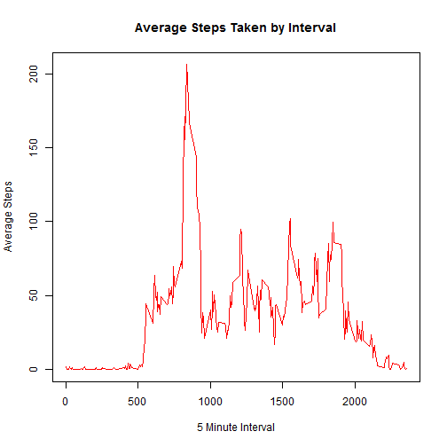
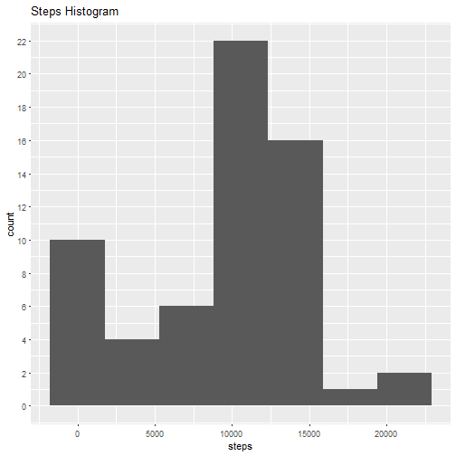
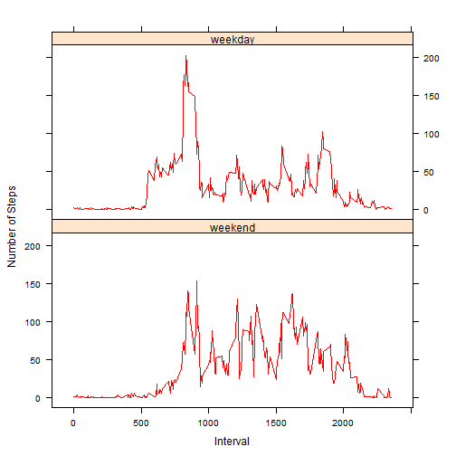

# Reproducible Research: Peer Assessment 1

## Loading and preprocessing the data

### Load Libraries 
Scientific notation is also turned off.

```r
options(scipen=999)
library(ggplot2)
library(chron)
library(dplyr)
library(lattice)
```

### Load the data


```r
summary <- read.csv("activity.csv", colClasses = c("numeric", "character", 
                                                 "numeric"))
```

### Transform

Transform date data into date type.

```r
summary$date <- as.Date(summary$date)
```

## What is mean total number of steps taken per day?

### 1. Total number of steps taken per day

```r
by_steps <- aggregate(steps ~ date, data = summary, sum, na.rm = TRUE)
```
### 2. Histogram of Total Steps Taken Each Day

```r
step_plot <- ggplot(by_steps, aes(x=steps)) + geom_histogram(bins=7)
step_plot <- step_plot + ggtitle("Steps Histogram") + scale_y_continuous(breaks =seq(0,25,2))

plot(step_plot)
```


### 3. Calculate and report the mean and median of the total number of steps taken per day

```r
by_date <- aggregate(summary$steps,by=list((substr(summary$date,1,53))),sum, na.rm = TRUE)
colnames(by_date)<-c("date","steps")

mean(by_date$steps)
```

```
## [1] 9354.23
```

```r
median(by_date$steps)
```

```
## [1] 10395
```

## What is the average daily activity pattern?

```r
interval_plot <- tapply(summary$steps, summary$interval, mean, na.rm = TRUE)
```

### 1. Time series plot

```r
plot(row.names(interval_plot), interval_plot, type = "l", xlab = "5 Minute Interval", 
     ylab = "Average Steps", main = "Average Steps Taken by Interval", 
     col = "red")
```



### 2. Which 5-minute interval contains the maximum number of steps?

```r
names(which.max(interval_plot))
```

```
## [1] "835"
```

## Imputing missing values

### 1. Calculate and report the total number of missing values in the dataset

```r
sum(is.na(summary))
```

```
## [1] 2304
```

### 2. Devise a strategy
Our strategy for filling in the NA values is to replace the NAs with the mean for that specific interval.
### 3. Create the new dataset with the NAs replaced


```r
interval <- as.data.frame.table(interval_plot)
colnames(interval) <- c("interval", "step_mean")

summary_na_free <- merge(summary,interval,by=c("interval"))
suppressWarnings(summary_na_free[, 2][is.na(summary_na_free[, 2])] <- summary_na_free[,4])
```

### 4. Make a histogram of the total number of steps taken each day and Calculate and report the mean and median total number of steps taken per day. 

```r
by_steps_na <- aggregate(steps ~ date, data = summary_na_free, sum, na.rm = TRUE)

step_plot_na <- ggplot(by_steps_na, aes(x=steps)) + geom_histogram(bins=7)
step_plot_na <- step_plot_na + ggtitle("Steps Histogram") + scale_y_continuous(breaks =seq(0,25,2))

plot(step_plot_na)
```



To find the mean and median total number of steps per day:

```r
by_date_na <- aggregate(summary_na_free$steps,by=list((substr(summary_na_free$date,1,53))),sum, na.rm = TRUE)
colnames(by_date_na)<-c("date","steps")

mean(by_date_na$steps)
```

```
## [1] 9371.437
```

```r
median(by_date_na$steps)
```

```
## [1] 10395
```

The median remains the same but the mean changes.

## Are there differences in activity patterns between weekdays and weekends?

### 1. Create a new factor variable in the dataset with two levels - "weekday" and "weekend" indicating whether a given date is a weekday or weekend day.

```r
summary_na_free$is_weekend <- factor(is.weekend(summary_na_free[, 3]))
levels(summary_na_free$is_weekend) <- list(weekend = TRUE, weekday = FALSE)
```

### 2. Make a panel plot containing a time series plot

```r
weekend_plot <- na.omit(aggregate(summary_na_free$steps, 
                          list(as.numeric(summary_na_free$interval),
                          summary_na_free$is_weekend), FUN = "mean"))
colnames(weekend_plot) <- c("interval","day_type","step_avg")

print(xyplot(weekend_plot$step_avg ~ weekend_plot$interval | weekend_plot$day_type, 
       layout = c(1, 2), type = "l", 
       xlab = "Interval", ylab = "Number of Steps", col = "red"))
```


